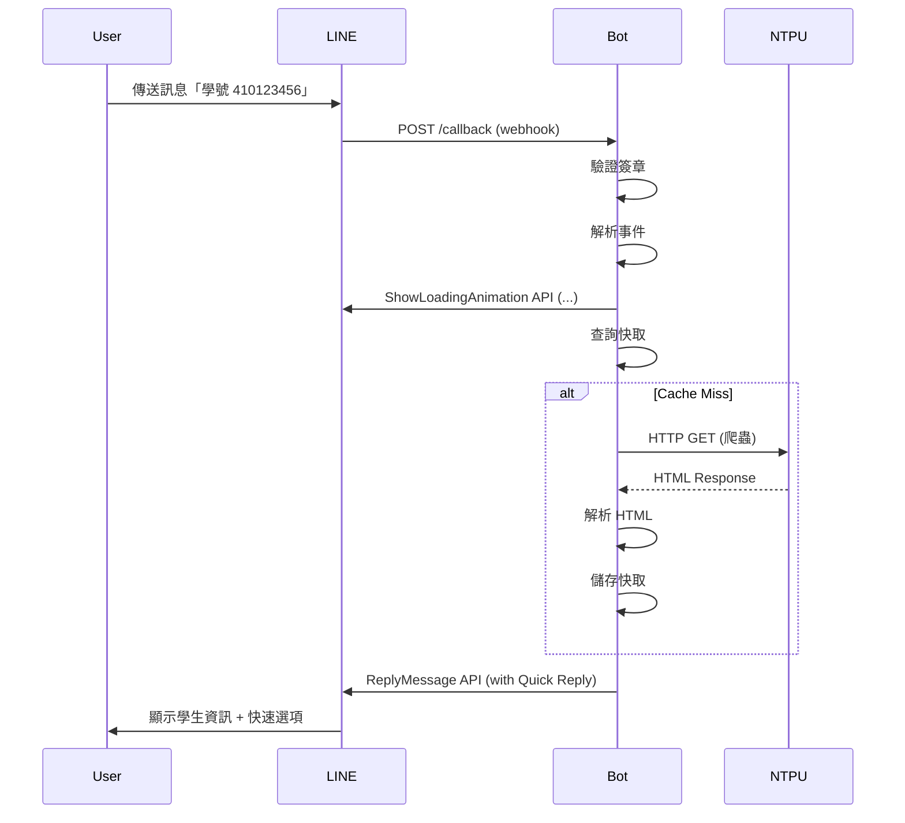

# NTPU LineBot Go - API 文件

## 概述

本文件描述 NTPU LineBot 的所有 HTTP API 端點和 LINE Messaging API 互動方式。

## HTTP API 端點

### 基本資訊

- **Base URL**: `http://localhost:10000` (本機) 或 `https://your-domain.com` (線上)
- **Content-Type**: `application/json`
- **Authentication**: LINE Webhook 需要簽章驗證

---

## 1. Health Check 端點

### 1.1 Liveness Probe (存活探測)

檢查服務是否存活（最小化檢查）。此端點**永不**檢查外部依賴，僅確認程序運行中。

```http
GET /healthz
```

**Response** (200 OK):
```json
{
  "status": "ok"
}
```

**用途**:
- Kubernetes/Docker liveness probe
- 簡單的服務健康檢查
- **不檢查依賴服務**（避免級聯失敗導致 pod 重啟）

---

### 1.2 Readiness Probe (就緒探測)

檢查服務是否準備好處理流量（完整依賴檢查）。失敗時返回 503，Kubernetes 會暫時移除流量，但不重啟 pod。

```http
GET /ready
```

**Response** (200 OK):
```json
{
  "status": "ready",
  "database": "connected",
  "scrapers": {
    "sea": true,
    "lms": true
  },
  "cache": {
    "students": 15234,
    "contacts": 823,
    "courses": 4521,
    "stickers": 42
  }
}
```

**Response** (503 Service Unavailable):
```json
{
  "status": "not ready",
  "reason": "database unavailable"
}
```

**檢查項目**:
- ✅ 資料庫連線
- ✅ Scraper URLs 可用性
- ✅ 快取資料數量

**用途**:
- Kubernetes readiness probe
- 確認服務完全就緒後才接收流量

---

## 2. LINE Webhook 端點

### 2.1 Webhook Callback

接收 LINE Platform 的 Webhook 事件。

```http
POST /callback
Content-Type: application/json
X-Line-Signature: {signature}
```

**Headers**:
- `X-Line-Signature`: LINE Platform 計算的 HMAC-SHA256 簽章（必填）

**Request Body** (來自 LINE):
```json
{
  "destination": "Uxxxx",
  "events": [
    {
      "type": "message",
      "replyToken": "xxxxx",
      "source": {
        "type": "user",
        "userId": "Uxxxx"
      },
      "timestamp": 1625097600000,
      "message": {
        "type": "text",
        "id": "xxxxx",
        "text": "學號 410123456"
      }
    }
  ]
}
```

**Response** (200 OK):
```json
{
  "status": "ok"
}
```

**Response** (400 Bad Request - 簽章錯誤):
```json
{
  "error": "invalid signature"
}
```

**Response** (413 Payload Too Large - 請求過大):
```json
{
  "error": "request too large"
}
```

**Response** (503 Service Unavailable - 資料來源不可用):
```json
{
  "error": "Service Unavailable"
}
```

**支援的事件類型**:
- `message` - 文字訊息、貼圖
- `postback` - 按鈕點擊回傳
- `follow` - 使用者加入好友

**限制**:
- Request body < 1MB
- 處理超時: 60 秒
- Global rate limit: 80 rps
- Per-user rate limit: 6 tokens, 1 token/5s refill (Token Bucket)

---

## 3. Prometheus 監控端點

### 3.1 Metrics

提供 Prometheus 格式的監控指標。

```http
GET /metrics
```

**Response** (200 OK):
```prometheus
# HELP ntpu_webhook_total Total webhook events processed
# TYPE ntpu_webhook_total counter
ntpu_webhook_total{event_type="message",status="success"} 1234

# HELP ntpu_webhook_duration_seconds Webhook processing duration in seconds
# TYPE ntpu_webhook_duration_seconds histogram
ntpu_webhook_duration_seconds_bucket{event_type="message",le="0.1"} 100
ntpu_webhook_duration_seconds_bucket{event_type="message",le="2"} 900
ntpu_webhook_duration_seconds_sum{event_type="message"} 234.56
ntpu_webhook_duration_seconds_count{event_type="message"} 1000

# ... 更多指標
```

**指標列表**:

採用 RED (Rate, Errors, Duration) 和 USE (Utilization, Saturation, Errors) 方法論設計。

| 指標名稱 | 類型 | 說明 | Labels |
|---------|------|------|--------|
| **Webhook (RED)** | | | |
| `ntpu_webhook_total` | Counter | Webhook 事件總數 | `event_type`, `status` |
| `ntpu_webhook_duration_seconds` | Histogram | Webhook 處理耗時 | `event_type` |
| **Scraper (RED)** | | | |
| `ntpu_scraper_total` | Counter | 爬蟲請求總數 | `module`, `status` |
| `ntpu_scraper_duration_seconds` | Histogram | 爬蟲請求耗時 | `module` |
| **Cache (USE)** | | | |
| `ntpu_cache_operations_total` | Counter | 快取操作總數 | `module`, `result` |
| `ntpu_cache_size` | Gauge | 快取項目數量 | `module` |
| **LLM (RED)** | | | |
| `ntpu_llm_total` | Counter | LLM API 請求總數 | `operation`, `status` |
| `ntpu_llm_duration_seconds` | Histogram | LLM API 請求耗時 | `operation` |
| **Search (RED)** | | | |
| `ntpu_search_total` | Counter | 智慧搜尋請求總數 | `type`, `status` |
| `ntpu_search_duration_seconds` | Histogram | 搜尋耗時 | `component` |
| `ntpu_search_results` | Histogram | 搜尋結果數量分布 | `type` |
| `ntpu_index_size` | Gauge | 索引文件數量 | `index` |
| **Rate Limiter (USE)** | | | |
| `ntpu_rate_limiter_dropped_total` | Counter | 被丟棄的請求數 | `limiter` |
| `ntpu_rate_limiter_users` | Gauge | 活動用戶限流器數量 | - |
| **Background Jobs** | | | |
| `ntpu_job_duration_seconds` | Histogram | 背景任務耗時 | `job`, `module` |

**PromQL 查詢範例**:

```promql
# Webhook 成功率 (使用 recording rule)
ntpu:webhook_success_rate:5m

# P95 延遲 (使用 recording rule)
ntpu:webhook_latency_p95:5m

# 快取命中率 (使用 recording rule)
ntpu:cache_hit_rate:5m

# 每秒請求數 (RPS)
sum(rate(ntpu_webhook_total[5m]))
```

---

## 4. Root 端點

### 4.1 Redirect to GitHub

```http
GET /
```

**Response** (301 Moved Permanently):
```
Location: https://github.com/garyellow/ntpu-linebot-go
```

---

## 業務邏輯

### 課程查詢學期判斷

系統會根據當前月份自動判斷要查詢哪個學期的課程：

| 月份 | 查詢學期 | 說明 |
|------|---------|------|
| 2-6月 | 當年度第2學期 + 第1學期 | 下學期進行中或結束 |
| 7-8月 | 當年度第2學期 + 第1學期 | 暑假期間（已結束學期）|
| 9-12月 + 1月 | 次年度第1學期 + 當年度第2學期 | 上學期進行中或寒假 |

**學年度定義**：西元年減去 1911 即為學年度（如 2024 年 9 月開始為 113 學年度）

**範例**（假設 N 為當前學年度）：
- 1 月 → 查詢 N 學年度第 1 學期（當前） + N-1 學年度第 2 學期（上一學期）
- 3 月 → 查詢 N 學年度第 2 學期（當前） + N 學年度第 1 學期（上一學期）
- 9 月 → 查詢 N+1 學年度第 1 學期（當前） + N 學年度第 2 學期（上一學期）

這樣設計確保使用者能查到當前學期及上一學期的課程資訊。

### 學號查詢年度限制

由於數位學苑 2.0 已於 2024 年停止使用，學號查詢功能僅提供 **101-112 學年度**的資料。

查詢 113 學年度（含）以後的資料時，系統會回應：
- 圖片：RIP 紀念圖
- 訊息：「數位學苑 2.0 已停止使用，無法取得資料」

---

## LINE Messaging API 互動

### 回覆訊息流程



### LINE API 限制

| 項目 | 限制 | 說明 |
|------|------|------|
| Reply Token | 單次使用 | 一個 replyToken 只能回覆一次 |
| 訊息數量 | 5 則 | 每次回覆最多 5 則訊息 |
| Quick Reply | 13 個 | 快速回覆按鈕最多 13 個 |
| 文字長度 | 5000 字元 | 超過會被截斷 |
| Postback Data | 300 bytes | 按鈕回傳資料長度 |
| Carousel Columns | 10 個 | 輪播訊息最多 10 個欄位 |
| API Rate Limit | 100 rps | 全域限制（我們設定 80 rps） |

### LINE Bot UX 最佳實踐

本專案遵循 LINE Messaging API 最佳實踐：

1. **Loading Animation (載入動畫)**
   - 在長查詢前顯示「...」動畫
   - 使用 `ShowLoadingAnimation` API
   - 最長顯示 60 秒

2. **Quick Reply (快速回覆)**
   - 在訊息下方提供快速選項
   - 引導使用者下一步操作
   - 減少輸入錯誤

3. **Flex Message (彈性訊息)**
   - 使用卡片式介面呈現資料
   - 支援按鈕、圖片、多欄位佈局
   - 提供更好的視覺體驗

4. **錯誤處理**
   - 隱藏技術細節
   - 提供可操作的選項
   - 友善的錯誤訊息

---

## 錯誤處理

### HTTP 狀態碼

| 狀態碼 | 說明 | 範例 |
|--------|------|------|
| 200 | 成功 | 正常處理 |
| 400 | 錯誤請求 | 簽章驗證失敗 |
| 413 | 請求過大 | Request body > 1MB |
| 429 | 請求過多 | 超過 rate limit |
| 500 | 伺服器錯誤 | 未預期的錯誤 |
| 503 | 服務不可用 | 資料來源無法連線 |

### 錯誤回應格式

```json
{
  "error": "invalid signature",
  "details": "X-Line-Signature header validation failed"
}
```

---

## 安全性

### 1. Webhook 簽章驗證

LINE Platform 使用 HMAC-SHA256 計算簽章：

```
Signature = Base64(HMAC-SHA256(Channel Secret, Request Body))
```

**驗證流程**:
```go
// LINE SDK 自動處理
cb, err := webhook.ParseRequest(channelSecret, request)
if err == webhook.ErrInvalidSignature {
    // 拒絕請求
}
```

### 2. HTTPS 要求

LINE Webhook **必須**使用 HTTPS：
- 開發測試: 使用 ngrok/cloudflare tunnel
- 線上環境: 使用有效的 SSL 憑證

### 3. Rate Limiting

**Global Level**:
```
80 requests/second (LINE API limit: 100 rps)
```

**Per-User Level**:
```
10 requests/second per user
```

超過限制會收到 HTTP 429 回應。

---

## 範例請求

### cURL 範例

#### 1. Health Check
```bash
curl -X GET http://localhost:10000/healthz
```

#### 2. Readiness Check
```bash
curl -X GET http://localhost:10000/ready
```

#### 3. Prometheus Metrics
```bash
curl -X GET http://localhost:10000/metrics
```

#### 4. 模擬 LINE Webhook (需要簽章)
```bash
# 計算簽章
echo -n '{"events":[{"type":"message","message":{"text":"test"}}]}' | \
openssl dgst -sha256 -hmac "YOUR_CHANNEL_SECRET" -binary | base64

# 發送請求
curl -X POST http://localhost:10000/callback \
  -H "Content-Type: application/json" \
  -H "X-Line-Signature: {calculated_signature}" \
  -d '{"events":[{"type":"message","message":{"text":"test"}}]}'
```

---

## Postman Collection

匯入以下 JSON 到 Postman:

```json
{
  "info": {
    "name": "NTPU LineBot API",
    "schema": "https://schema.getpostman.com/json/collection/v2.1.0/collection.json"
  },
  "item": [
    {
      "name": "Health Check",
      "request": {
        "method": "GET",
        "url": "{{base_url}}/healthz"
      }
    },
    {
      "name": "Readiness Check",
      "request": {
        "method": "GET",
        "url": "{{base_url}}/ready"
      }
    },
    {
      "name": "Prometheus Metrics",
      "request": {
        "method": "GET",
        "url": "{{base_url}}/metrics"
      }
    }
  ],
  "variable": [
    {
      "key": "base_url",
      "value": "http://localhost:10000"
    }
  ]
}
```

---

## 附錄

### A. LINE Messaging API 參考

- [Official Documentation](https://developers.line.biz/en/docs/messaging-api/)
- [Webhook Events](https://developers.line.biz/en/reference/messaging-api/#webhook-event-objects)
- [Message Types](https://developers.line.biz/en/reference/messaging-api/#message-objects)

### B. Prometheus 監控

- [Prometheus Query Examples](https://prometheus.io/docs/prometheus/latest/querying/examples/)
- [Grafana Dashboard](http://localhost:3000)

### C. 聯絡方式

- **GitHub Issues**: https://github.com/garyellow/ntpu-linebot-go/issues
- **維護者**: garyellow
